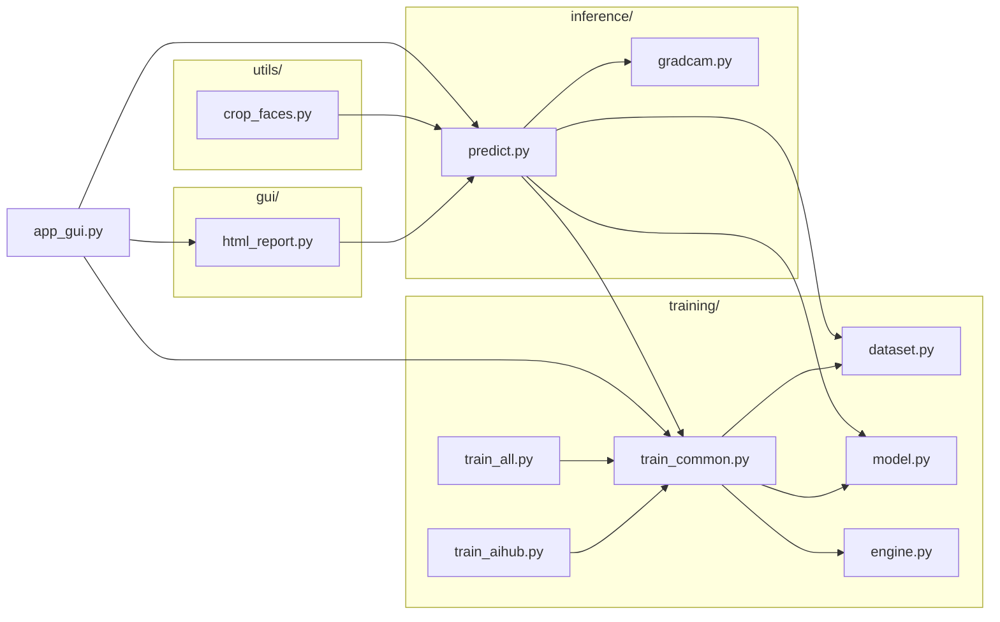
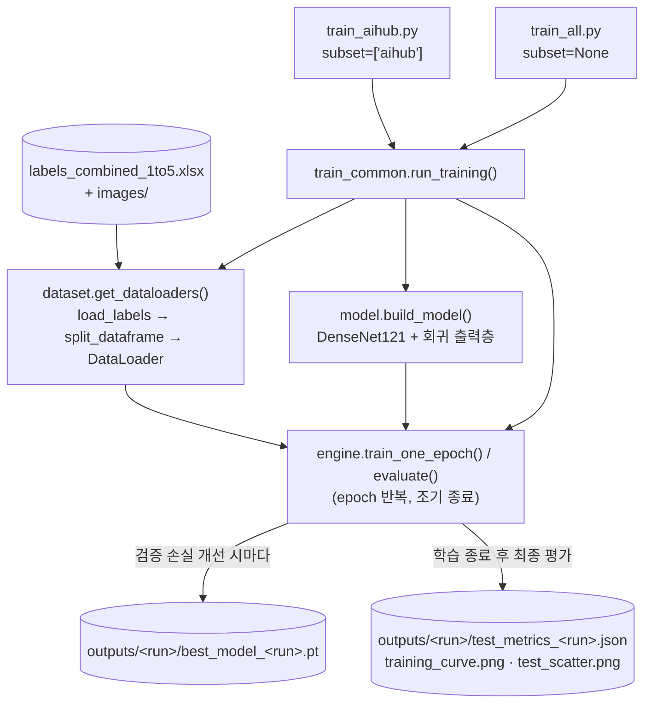
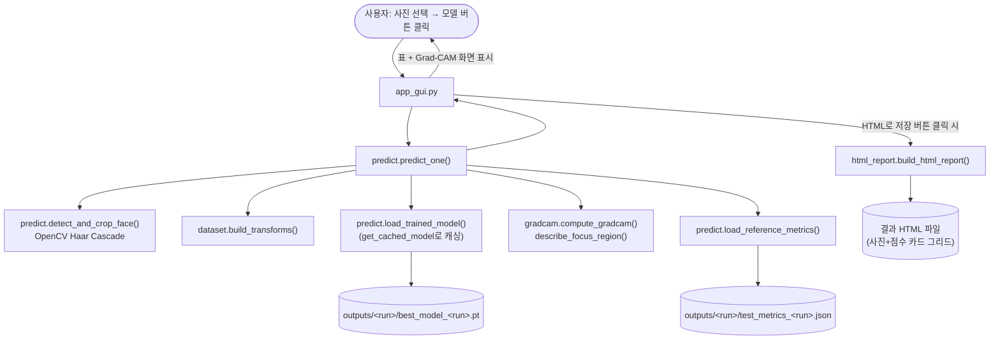
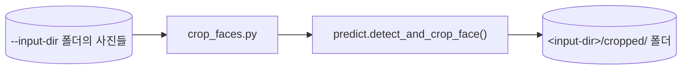

# 얼굴 매력도 예측 프로젝트 — DenseNet121 파이프라인

얼굴 이미지의 매력도를 1~5점 척도로 예측하는 로컬(CPU) 파이프라인입니다. ImageNet 사전학습 DenseNet121의 분류층을 1개 출력 회귀층으로 교체해 1~5점을 직접 예측하며, 학습 · 추론 · 데스크톱 GUI · Grad-CAM 설명(XAI)까지 이 저장소 안에서 모두 실행합니다.

## 폴더 구조

```
image_attractive_visionProject/
├── images/                        # 원본 얼굴 이미지 (4개 도메인 하위 폴더)
│   ├── aihub/
│   ├── scut_fbp5500/
│   ├── 남자연예인/
│   └── 여자연예인/
├── labels_combined.xlsx           # 원본 척도가 섞인 라벨
├── labels_combined_1to5.xlsx      # 1~5점으로 통일 정규화한 라벨 (학습에 사용하는 파일)
├── stats.json                     # 도메인별 라벨 분포 통계 (dashboard.html이 참조)
├── dashboard.html                 # 라벨링 현황을 보여주는 정적 대시보드 (브라우저로 바로 열기)
├── DenseNet121/                   # 학습/추론/GUI 파이프라인 (파이썬 패키지) — "코드 구성" 절 참고
└── outputs/                       # 학습 결과물 (체크포인트/지표/그래프). git 미추적, 로컬 생성물
```

## 데이터 계약

- 필수 열: `dataset`, `filename`, `score`, `score_scale`.
- 도메인: `aihub`, `scut_fbp5500`, `남자연예인`, `여자연예인`.
- `filename`: `images/<dataset>/` 기준 상대 경로 또는 유일한 파일명.
- `score`: 누락 없는 숫자 1~5 (`labels_combined_1to5.xlsx` 기준).
- 선택 열 `person_id`: 같은 인물은 도메인과 관계없이 같은 ID를 사용.

원본 이미지·엑셀은 읽기 전용으로만 사용합니다.

## 코드 구성 (`DenseNet121/`)

역할이 비슷한 코드끼리 하위 패키지로 묶어 두었습니다. `app_gui.py`는 실제로 실행해서 쓰는 진입점이라 `DenseNet121/` 바로 아래에 두었고, 나머지는 역할별 하위 폴더에 있습니다.

```
DenseNet121/
├── app_gui.py      # 진입점 — 데스크톱 GUI (더블 실행 편의를 위해 최상위에 위치)
├── training/       # 데이터 준비 · 모델 정의 · 학습 루프
│   ├── dataset.py
│   ├── model.py
│   ├── engine.py
│   ├── train_common.py
│   ├── train_aihub.py
│   └── train_all.py
├── inference/      # 학습된 모델로 새 이미지를 예측 + 설명(XAI)
│   ├── predict.py
│   └── gradcam.py
├── gui/            # GUI가 사용하는 결과 리포트 생성 로직
│   └── html_report.py
├── utils/          # 독립 유틸리티 스크립트
│   └── crop_faces.py
└── requirements.txt
```

| 파일 | 역할 |
|---|---|
| `app_gui.py` | 진입점 — tkinter 데스크톱 GUI (사진 선택 → 모델 선택 → 결과 표/Grad-CAM 확인 → HTML 저장) |
| `training/model.py` | DenseNet121 백본 로딩 + 회귀용 출력층(1개) 교체 |
| `training/dataset.py` | 라벨 엑셀 로딩, 이미지 존재 검증, train/val/test 층화 분할, `Dataset`/`DataLoader` 생성 |
| `training/engine.py` | 1 epoch 학습/평가 루프, MAE·RMSE·Pearson r·정확도 계산, 체크포인트/지표/그래프 저장 |
| `training/train_common.py` | `train_aihub.py`·`train_all.py`가 공유하는 CLI 인자 정의 + 전체 학습 루프(`run_training`) |
| `training/train_aihub.py` | 진입점 — `dataset == "aihub"` 데이터만 사용해 학습 (`outputs/aihub/`) |
| `training/train_all.py` | 진입점 — 4개 도메인 전체 데이터로 학습 (`outputs/all/`) |
| `inference/predict.py` | 진입점 겸 공용 로직 — 새 이미지 1장에 대해 얼굴 검출(Haar Cascade) → 크롭 → 학습된 모델로 점수 예측 |
| `inference/gradcam.py` | Grad-CAM으로 "모델이 얼굴의 어느 부위를 보고 점수를 매겼는지" 히트맵·설명 생성 |
| `gui/html_report.py` | 여러 장을 한 번에 측정한 결과를 카드 그리드 형태의 단일 HTML 파일로 저장 |
| `utils/crop_faces.py` | 진입점 — 폴더 단위로 얼굴만 검출해 `cropped/` 하위 폴더에 저장하는 독립 유틸리티 |
| `requirements.txt` | 이 파이프라인 전용 의존성 목록 |

`app_gui.py`, `utils/crop_faces.py`를 제외한 모든 파일은 다른 파일에서 import되어 실제로 쓰이고 있으며, 점검 결과 사용되지 않는 코드(죽은 코드)는 없었습니다.

## 동작 흐름 (플로우차트)

### 1. 모듈 의존 관계 (누가 누구를 import하는지)



### 2. 학습 실행 흐름 (`train_aihub.py` / `train_all.py`)



### 3. 예측 + GUI 실행 흐름 (`app_gui.py`)



### 4. 얼굴 크롭 유틸리티 (`crop_faces.py`)



## 실행 방법

각 진입점 파일은 실행 위치·방식과 무관하게 자기 위치를 기준으로 `DenseNet121/` 폴더를 찾아 `sys.path`에 등록한 뒤 나머지 모듈을 import하므로, 아래 두 방식 모두 그대로 동작합니다.

```bash
pip install -r DenseNet121/requirements.txt

# 방식 A: 파일 경로로 직접 실행 (더블클릭·IDE의 "실행" 버튼과 동일한 방식)
python DenseNet121/app_gui.py
python DenseNet121/training/train_aihub.py --epochs 7
python DenseNet121/training/train_all.py --epochs 7
python DenseNet121/inference/predict.py --image ./someone.jpg --model both
python DenseNet121/utils/crop_faces.py --input-dir "./새사진폴더"

# 방식 B: 프로젝트 루트에서 -m 모듈 방식 (동일하게 동작)
python -m DenseNet121.app_gui
python -m DenseNet121.training.train_aihub --epochs 7
python -m DenseNet121.inference.predict --image ./someone.jpg --model both
```

모든 진입점(`app_gui`, `train_aihub`, `train_all`, `predict`, `crop_faces`)을 두 실행 방식 모두로 직접 실행해 정상 동작(GUI 창 실제 실행, 얼굴 검출 → 예측 → Grad-CAM, 데이터 로딩 → 모델 forward/backward)을 확인했습니다.

## 저장 결과 (`outputs/<run_name>/`)

- `best_model_<run_name>.pt` — 검증 손실이 가장 낮았던 체크포인트
- `test_metrics_<run_name>.json` — 테스트셋 MAE/RMSE/Pearson r/정확도 및 예측값 원본
- `training_curve_<run_name>.png`, `test_scatter_<run_name>.png` — 학습 곡선, 예측 vs 실제 산점도

## 결과

| 학습 데이터 | Test n | MAE ↓ | RMSE ↓ | Pearson r ↑ | 정확도(±1점) ↑ |
|---|---:|---:|---:|---:|---:|
| 전체 데이터 (`all`) | 729 | 0.4045 | 0.5229 | 0.8131 | 99.04% |
| AIHub만 (`aihub`) | 91 | 0.7382 | 0.9128 | 0.3573 | 90.11% |

## 참고 사항

- `outputs/`는 git에서 추적하지 않는 로컬 생성물입니다. 위 학습 명령을 다시 실행하면 재생성됩니다.
