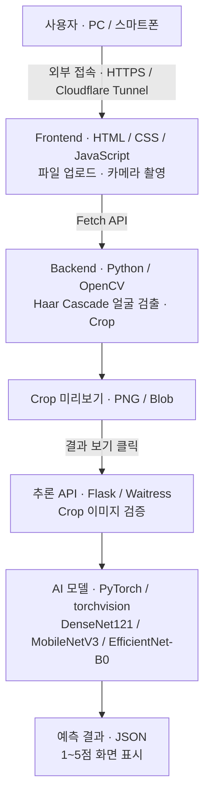

# 얼굴 매력도 평가 애플리케이션 
_**현대오토에버 SW스쿨 스마트팩토리 4기 1차 비전 프로젝트**_

## 개요

## 학습 데이터
| Dataset | 개수 | 설명 |
|---|---:|---|
| **AIHub** | 606 | 한국인 얼굴 이미지 기반 점수 데이터 |
| **SCUT-FBP5500** | 4,000 | 얼굴 이미지와 매력도 점수가 포함된 공개 데이터셋 |
| **남자연예인** | 89 | 남자 연예인 얼굴 이미지 점수 데이터 |
| **여자연예인** | 163 | 여자 연예인 얼굴 이미지 점수 데이터 |
| **5_male** | 132 | **남성 5점 데이터 부족을 보완하기 위해 추가한 얼굴 이미지** |
| **5_female** | 192 | **여성 5점 데이터 부족을 보완하기 위해 추가한 얼굴 이미지** |
| **전체** | **5,182** | 전체 학습용 얼굴 이미지 데이터 |

## 사용 모델

이미지 인식에 사용되는 CNN 계열 딥러닝 신경망들을 사용

EfficientNet-B0 , MobileNetV3 , ResNet50 , DenseNet121 , NASNet

## 모델 지표

| 모델 | **MAE ↓** | **RMSE ↓** |
|---|---:|---:|
| **EfficientNet-B0** | 0.4065 | 0.5309 |
| **MobileNetV3** | 0.4446 | 0.5675 |
| **ResNet50** | 0.4983 | 0.6234 |
| **DenseNet121** | **0.4045** | **0.5229** |
| **NASNet** | 0.6344 | 0.8093 |

**평가 지표 설명**
- MAE (Mean Absolute Error) ↓: 실제 점수와 예측 점수의 평균 절대 오차
- RMSE (Root Mean Squared Error) ↓: 큰 예측 오차에 더 큰 패널티를 주는 지표

**가장 성능이 좋은 EfficientNet-B0 , MobileNetV3 , DenseNet121
세 모델을 사용하기로 결정**

## 웹 애플리케이션 아키텍처

## 사용 기술
| 구분 | 사용 기술 | 역할 |
|---|---|---|
| 프런트엔드 | HTML, CSS, JavaScript | 이미지 선택, 모델 선택, Crop 미리보기, 점수 표시 |
| 카메라 촬영 | getUserMedia, Canvas API | 카메라 접근 및 촬영 이미지 생성 |
| 서버 통신 | Fetch API | Crop·추론 요청과 결과 수신 |
| 백엔드 | Python, Flask | 이미지 수신, 검증, API 처리 |
| 운영 서버 | Waitress | Windows에서 웹 애플리케이션 실행 |
| 얼굴 검출 | OpenCV, Haar Cascade | 얼굴 검출 및 가장 큰 얼굴 영역 선택 |
| 이미지 처리 | Pillow, NumPy | EXIF 보정, RGB 변환, Crop·PNG 생성 |
| 모델 추론 | PyTorch, torchvision | 학습된 모델 로딩, 전처리 및 점수 예측 |
| AI 모델 | DenseNet121, MobileNetV3, EfficientNet-B0 | 얼굴 이미지의 1~5점 회귀 예측 |
| Crop 일치 검증 | HMAC-SHA256 | 미리보기와 추론에 사용되는 이미지의 동일성 검증 |
| 외부 접속 | Cloudflare Tunnel, HTTPS | 외부 PC·스마트폰에서 Windows 서버에 접속 |
| 데이터 전달 | PNG, JSON | Crop 이미지 및 예측 결과 전달 |

