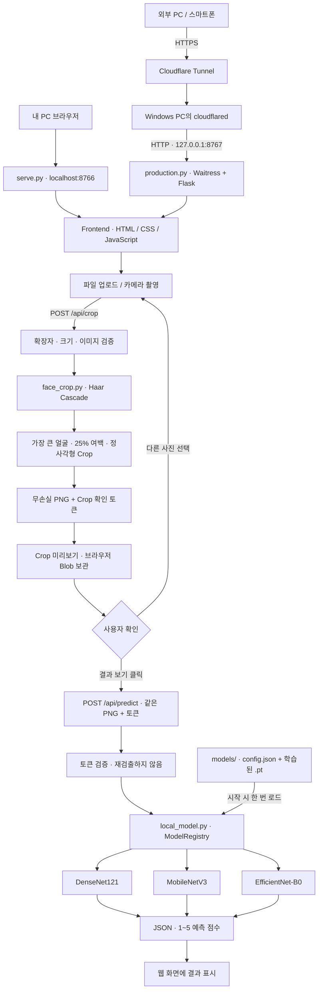

# 얼굴 이미지 점수 예측 웹 애플리케이션

_현대오토에버 스마트팩토리 과정 비전 프로젝트 - 1_

업로드하거나 촬영한 사진에서 얼굴을 검출하고, 사용자가 Crop 결과를 확인한 후 선택한 모델로 1~5점의 예측 점수를 계산합니다.

- 지원 모델: DenseNet121, MobileNetV3, EfficientNet-B0
- 사용 순서: **모델 선택 → 사진 선택/촬영 → 얼굴 Crop 미리보기 → 결과 보기 → 점수 확인**

- DB 없이 메모리에서 처리, 업로드 사진을 파일로 저장하지 않습니다.

## 1. 전체 아키텍처




## 2. 실행 방법

### 2.1 공통 준비

Windows와 Python 3.12 기준입니다. 

새 PC에서는 소스 외에 다음 모델 파일도 별도로 준비해야 합니다. `.pt`와 `.venv`는 Git에서 제외됩니다.

```text
models/densenet121/best_model_all.pt
models/mobilenetv3/mobilenetv3_regression_final.pt
models/efficientnet_b0/EfficientNetAllImage.pt
```

프로젝트 루트의 `cropping/crop_local_idol_faces_haar.py`와`DenseNet121/training/model.py`도 import하므로 `face_score_web` 폴더만 단독 복사하면 실행되지 않습니다.

### 2.2 로컬에서 실행

PowerShell:

```powershell
cd C:\sungwon\image_attractive_visionProject\face_score_web

# 최초 1회: 가상환경 및 로컬 의존성 설치
if (-not (Test-Path .\.venv\Scripts\python.exe)) {
    py -3.12 -m venv .venv
}
.\.venv\Scripts\python.exe -m pip install -r requirements-local.txt

# 매번 실행
.\.venv\Scripts\python.exe serve.py
```

브라우저에서 [http://localhost:8766](http://localhost:8766)을 엽니다. 

설치가 끝났다면 `start_local.cmd`를 더블클릭해도 됩니다. 

처음에는 `setup_local.cmd`를 사용할 수도 있습니다. 

종료는 실행 창에서 **Ctrl+C**입니다.

포트 변경:

```powershell
.\.venv\Scripts\python.exe serve.py --port 8768
```

로컬 모델 기본 선택은 DenseNet121입니다. 

화면의 콤보박스에서 다른 모델을 선택할 수 있습니다.

### 2.3 Cloudflare Tunnel로 외부 HTTPS 접속 열기

공개 접속에는 `serve.py` 대신 Windows 운영용 `production.py`를 사용합니다. **서버 창과 Tunnel 창을 모두 유지**해야 합니다.

**① PowerShell 창 A: 운영 패키지 설치 및 서버 실행**

```powershell
cd C:\sungwon\image_attractive_visionProject\face_score_web

# 2.2에서 가상환경을 만든 뒤 실행
.\.venv\Scripts\python.exe -m pip install -r requirements.txt

$env:HOST = '127.0.0.1'
$env:PORT = '8767'
$env:PUBLIC_ORIGIN = ''
$env:DEFAULT_MODEL = 'efficientnet_b0'
$env:ENABLED_MODELS = 'densenet121,mobilenetv3,efficientnet_b0'

.\.venv\Scripts\python.exe production.py
```

[http://localhost:8767](http://localhost:8767)에서 먼저 정상 동작을 확인합니다.

**② PowerShell 창 B: cloudflared 설치**

```powershell
winget install --id Cloudflare.cloudflared --exact
```

설치 후 새 PowerShell 창에서 `cloudflared --version`을 확인합니다. `winget`이 없다면 [Cloudflare 공식 다운로드](https://developers.cloudflare.com/cloudflare-one/networks/connectors/cloudflare-tunnel/downloads/)에서 Windows 실행 파일을 설치합니다.

**③ 창 B: 임시 HTTPS 주소 생성**

```powershell
cloudflared tunnel --url http://127.0.0.1:8767
```

출력되는 `https://....trycloudflare.com` 주소를 복사합니다. 

아직 주소를 허용하지 않아 외부 요청에 403이 나올 수 있습니다.

**④ 창 A: 공개 주소를 허용하고 앱 재시작**

Ctrl+C로 앱만 종료한 뒤, 아래 예제 주소를 실제 발급 주소로 바꿉니다.

```powershell
$env:PUBLIC_ORIGIN = 'https://실제발급주소.trycloudflare.com'
.\.venv\Scripts\python.exe production.py
```

다른 PC나 스마트폰에서 이 HTTPS 주소로 접속합니다. Tunnel 주소가 바뀌면 `PUBLIC_ORIGIN`도 바꾸고 앱을 재시작해야 합니다. 기존 `start_production.ps1 -PublicOrigin 'https://실제주소'` 스크립트로도 운영 앱을 실행할 수 있습니다.

- Tunnel은 같은 PC의 `127.0.0.1`에 접속하므로 공유기 포트포워딩과 8767 인바운드 방화벽 개방은 필요하지 않습니다.
- 기관 네트워크에서는 cloudflared의 아웃바운드 TCP/UDP 7844 통신이 허용되어야 합니다.
- PC 종료·절전, 인터넷 단절, 앱/Tunnel 종료 시 외부 접속도 중단됩니다.
### 2.4 운영 환경변수

| 변수 | 기본값 | 의미 |
|---|---|---|
| `HOST` | `127.0.0.1` | 운영 서버 바인딩 주소. 필요 시 `0.0.0.0` 지정 가능하나 같은 PC의 Tunnel에는 불필요 |
| `PORT` | `8767` | 운영 서버 포트 |
| `PUBLIC_ORIGIN` | 빈 값 | 허용할 공개 HTTPS 출처. 경로 없이 입력 |
| `DEFAULT_MODEL` | `efficientnet_b0` | 운영 화면 기본 모델 |
| `ENABLED_MODELS` | 3종 모두 | 쉼표로 구분한 활성 모델 ID |

EfficientNet만 실행하려면 `ENABLED_MODELS=efficientnet_b0`로 설정합니다. `.env.example`은 참고용이며 앱이 `.env`를 자동으로 읽지는 않습니다. PowerShell의 `$env:`로 설정하세요. 로컬 `serve.py`는 `--port`, `--checkpoint` 명령행 옵션을 사용하며 `--checkpoint`는 DenseNet 가중치 경로를 바꿉니다.

## 3. 파일 구조

```text
image_attractive_visionProject/
├── cropping/
│   └── crop_local_idol_faces_haar.py  # 크롭 기능
├── DenseNet121/training/model.py     # DenseNet 회귀 모델 정의
└── face_score_web/
    ├── frontend/
    │   ├── index.html               # 이미지·모델 선택, 미리보기, 결과 UI
    │   ├── css/styles.css           # 모바일 폭 기반 화면 스타일
    │   └── js/
    │       ├── app.js               # 업로드·촬영·상태·요청 순서 관리
    │       └── model.js             # Crop / Prediction API 호출
    ├── serve.py                     # 로컬 전용 HTTP 서버, 기본 8766
    ├── production.py                # Flask + Waitress 운영 서버, 기본 8767
    ├── face_crop.py                 # Haar 검출·PNG 생성·Crop 토큰 검증
    ├── local_model.py               # 모델 로딩·전처리·회귀 추론
    ├── models/
    │   ├── README.md                # 모델 교체 규칙
    │   ├── densenet121/
    │   │   ├── config.json
    │   │   └── best_model_all.pt
    │   ├── mobilenetv3/
    │   │   ├── config.json
    │   │   └── mobilenetv3_regression_final.pt
    │   └── efficientnet_b0/
    │       ├── config.json
    │       └── EfficientNetAllImage.pt
    ├── requirements-local.txt       # 로컬 실행 패키지
    ├── requirements.txt             # 운영 실행 패키지 포함
    ├── setup_local.cmd              # 로컬 가상환경 준비
    ├── start_local.cmd              # 로컬 서버 실행
    ├── start_production.ps1          # 운영 서버 실행 보조 스크립트
    ├── .env.example                 # 환경변수 참고 예제
    ├── cloudflared.example.yml       # 고정 도메인 Tunnel 예제
    ├── runtime/                     # 실행 로그 등 임시 자료, Git 제외
    ├── test_crop.py                 # 실제 Haar 검출·Crop 테스트
    ├── test_local.py                # 로컬 API 통합 테스트
    ├── test_production.py           # 운영 API 및 접근 제한 테스트
    ├── test_frontend.cjs            # 상태 초기화·race·버튼 추론 테스트
    ├── CROP_FLOW.md                 # Crop 구현 상세
    ├── DEPLOY_WINDOWS.md            # 배포·방화벽·Git 점검 상세
    ├── docs/                       # 초기 설계 참고 문서
    └── dist/                       # 이전 정적 배포 결과, 현재 실행에 사용하지 않음
```

학습용 이미지·라벨·노트북은 웹 추론에 필요하지 않습니다. 모델 교체 시 해당 `models/` 폴더의 `.pt`를 바꾸고 파일명이 달라지면 `config.json`의 `checkpoint`를 수정한 뒤 서버를 재시작합니다. 아키텍처·전처리·출력층 계약도 같아야 합니다. [모델 관리 안내](models/README.md)

## 4. 사용 패키지와 모델 전처리

| 패키지/기능 | 버전 | 용도 |
|---|---|---|
| Python | 3.12 기준 | 서버와 추론 실행 |
| PyTorch | `2.14.0+cpu` | 체크포인트 로딩, 텐서 연산, 추론 |
| torchvision | `0.29.0+cpu` | 모델 구조 및 이미지 전처리 |
| Pillow | `12.3.0` | 이미지 decode, EXIF 보정, RGB, PNG 생성 |
| opencv-python-headless | `4.13.0.92` | Haar Cascade 얼굴 검출, 히스토그램 평활화 |
| NumPy | OpenCV/torchvision 의존성으로 설치 | PIL/OpenCV 배열 변환 |
| Flask | `3.1.2` | 운영용 API·정적 파일 라우팅 |
| Waitress | `3.0.2` | Windows 운영 WSGI 서버 |
| Python 표준 라이브러리 | 별도 설치 없음 | 로컬 HTTP 서버, JSON, HMAC, threading |
| 브라우저 API | 별도 패키지 없음 | Fetch, Blob, Canvas, getUserMedia, AbortController |
| cloudflared | 별도 프로그램 | Cloudflare와 Windows 서버 사이의 터널 |

Frontend는 HTML/CSS/JavaScript이며 npm 빌드나 Node 서버가 필요하지 않습니다. Node.js는 `test_frontend.cjs` 테스트를 실행할 때만 사용합니다. 카메라는 localhost 또는 HTTPS 환경에서 브라우저 권한을 허용해야 합니다.

| 모델 ID | 전처리 (Haar Crop 이후) | 출력 |
|---|---|---|
| `densenet121` | 224×224 bilinear Resize + ImageNet 정규화 | 직접 회귀, 표시 범위 1~5 제한 |
| `mobilenetv3` | 224×224 bilinear Resize + ImageNet 정규화 | 직접 회귀, 표시 범위 1~5 제한 |
| `efficientnet_b0` | 짧은 변 256 bicubic Resize → CenterCrop 224 → ImageNet 정규화 | `1 + 4 × sigmoid` |

각 활성 모델은 서버 시작 시 한 번만 로드하고 `eval()` 및 `torch.inference_mode()`로 실행합니다. 모델 다운로드·재학습은 요청 처리 중 수행하지 않습니다.

## 5. API 설명

### API 목록

| 메서드 | 경로 | 역할 |
|---|---|---|
| GET | `/` | 웹 화면 |
| GET | `/api/health` | 모델 준비 상태 |
| GET | `/api/models` | 모델 목록과 사용 가능 여부 |
| POST | `/api/crop` | 원본 → 얼굴 검출 → Crop PNG. **추론하지 않음** |
| POST | `/api/predict?model=efficientnet_b0` | 사용자가 확인한 Crop PNG로 점수 예측 |

운영 서버는 `/api/health`, `/api/models` 응답에 `default_model`도 포함합니다. 로컬 서버는 이 필드가 없어 Frontend가 첫 사용 가능 모델을 선택합니다.

### POST /api/crop

요청은 `multipart/form-data`가 아니라 **이미지 파일의 바이너리 본문**입니다.

```http
POST /api/crop
Content-Type: application/octet-stream
X-Filename: photo.jpg

<원본 이미지 바이트>
```

한글 파일명은 `encodeURIComponent(filename)`으로 헤더에 전달합니다. `.jpg`, `.jpeg`, `.png`, `.webp` 확장자와 실제 이미지 내용을 검사하며 최대 10MB, 2,000만 화소를 허용합니다.

성공 응답:

```http
HTTP/1.1 200 OK
Content-Type: image/png
X-Crop-Token: <서명된 Crop 확인 토큰>
X-Face-Count: 1

<Crop된 무손실 PNG 바이트>
```

얼굴이 여러 개면 가장 큰 얼굴 하나를 선택하고 25% 여백의 정사각형 영역을 만듭니다. 검출 실패 시 원본으로 추론하지 않습니다. 브라우저는 반환된 PNG를 미리보기와 다음 요청에 동일하게 사용합니다.

### POST /api/predict

```http
POST /api/predict?model=efficientnet_b0
Content-Type: application/octet-stream
X-Filename: face-crop.png
X-Crop-Token: <Crop 응답에서 받은 토큰>

<Crop 응답과 정확히 같은 PNG 바이트>
```

응답 예시 (값은 예시):

```json
{
  "score": 3.12,
  "raw_score": 0.12,
  "model": "EfficientNet-B0",
  "model_id": "efficientnet_b0",
  "checkpoint": "EfficientNetAllImage.pt",
  "device": "cpu",
  "score_scale": [1, 5]
}
```

`score`는 화면에 표시할 1~5점이고, `raw_score`는 출력 변환 전 모델 값입니다. EfficientNet의 `raw_score`는 sigmoid 이전 값이므로 1~5 범위가 아닐 수 있습니다.

토큰은 PNG 바이트에 대한 HMAC 서명이며 유효기간은 30분입니다. 토큰 누락·만료·이미지 변조·서버 재시작 시 다시 사진을 선택해야 합니다. 토큰은 사용자 로그인/인증을 대신하지 않습니다. 현재는 단일 서버 프로세스 기준입니다.

### 오류 응답

대부분의 앱 오류는 `{"error": "안내 메시지"}` 형식입니다. Waitress나 Cloudflare가 앱에 전달하기 전에 거절한 요청은 다른 형식일 수 있습니다.

| HTTP 상태 | 의미 |
|---|---|
| `400` | 잘못된 이미지·확장자·픽셀 크기·모델 요청 |
| `403` | 허용하지 않은 Host/Origin |
| `409` | Crop 토큰 누락·만료·변조 |
| `413` | 파일 크기 초과 (로컬 서버는 빈 본문도 이 코드로 거절) |
| `415` | 잘못된 요청 Content-Type |
| `422` | 얼굴 검출 실패 |
| `429` | 운영 서버가 다른 Crop/추론 요청을 처리 중 |
| `500` | 내부 이미지 처리/추론 오류 |

